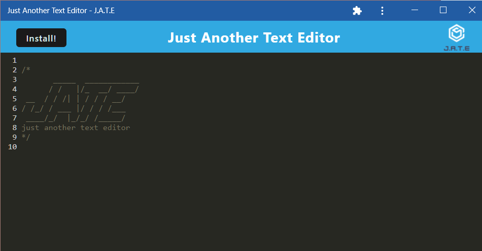

  # Just Another Text Editor (J.A.T.E.)

  ## Table of Contents
  * [Description](#description)
  * [Installation](#installation)
  * [Usage](#usage)
  * [Questions](#questions)

  ## Description

  This PWA is Just Another Text Editor made with CodeMirror, webpack.js, and IdbDatabase. You can use the app on the web or installed on your personal machine, write notes, and find them again whenever you need!

   

  ## Installation

  To install the dev environment, simply clone the repo and type this into your terminal:

    npm i
  
  To install the program on your local device, simply click the "Install!" button on the top-left corner.

  

   

  ## Usage

  Upon opening the base application, you can type text in the dedicated text editor to make a note! The text body is saved using Idb, so whatever you write will be ready for you whenever you reload the program. 

   
  
  ## Questions

  For more information, feel free to contact me:

  E-mail: 

  GitHub: [github.com/stevengoldbergm](https://github.com/stevengoldbergm)
  